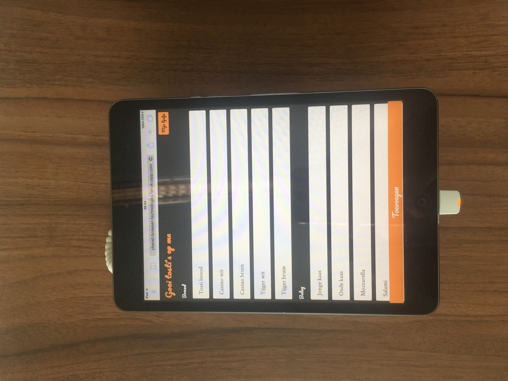
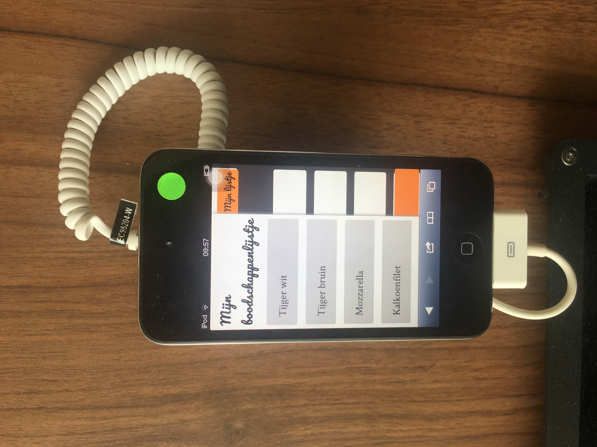
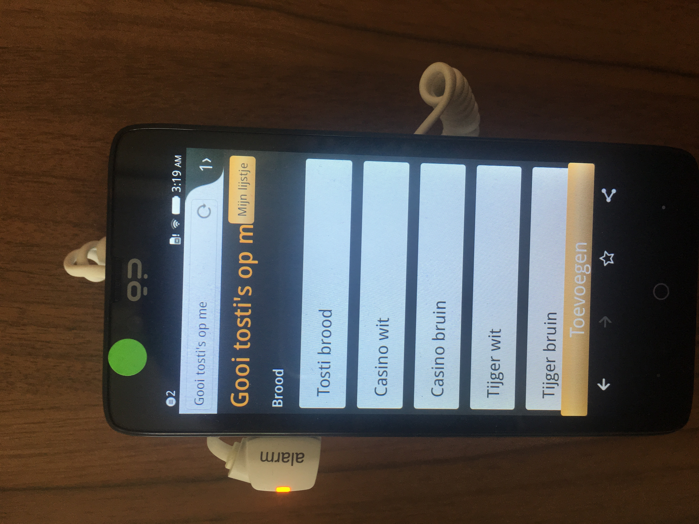
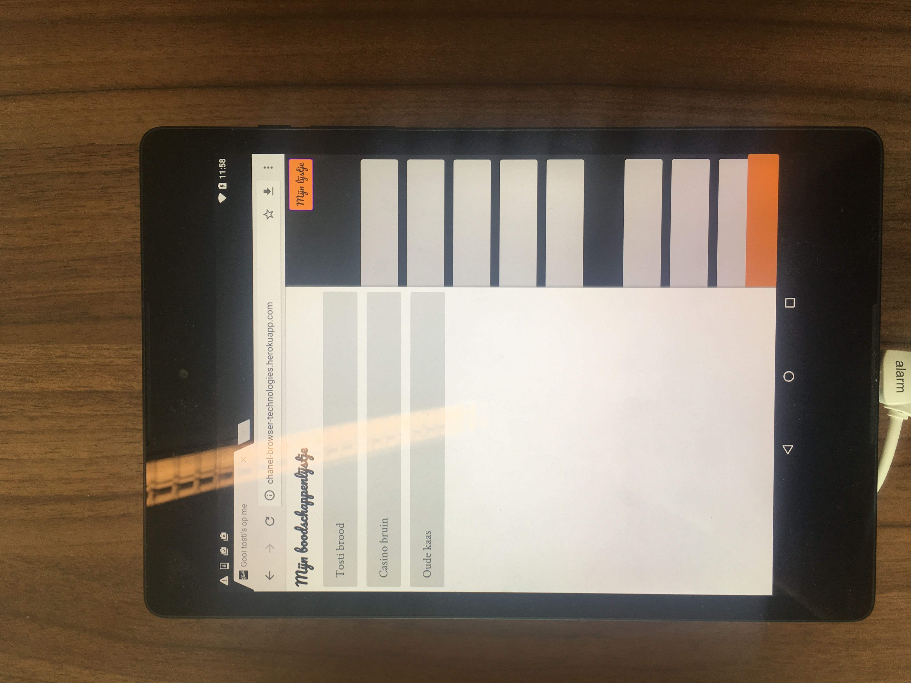
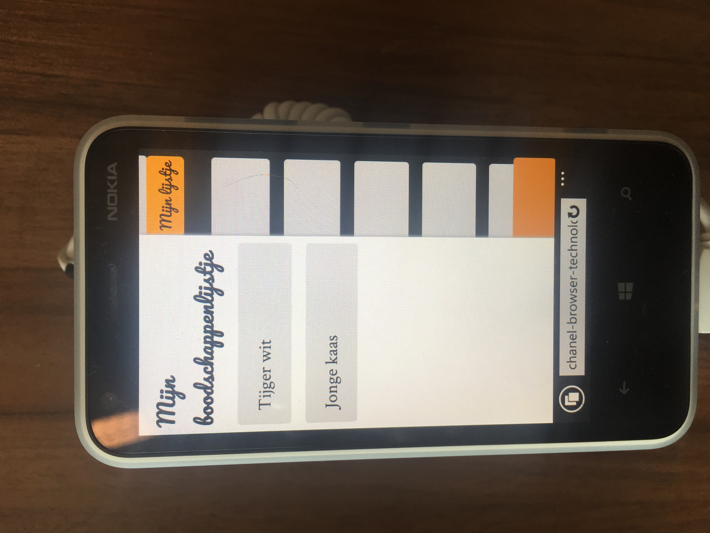
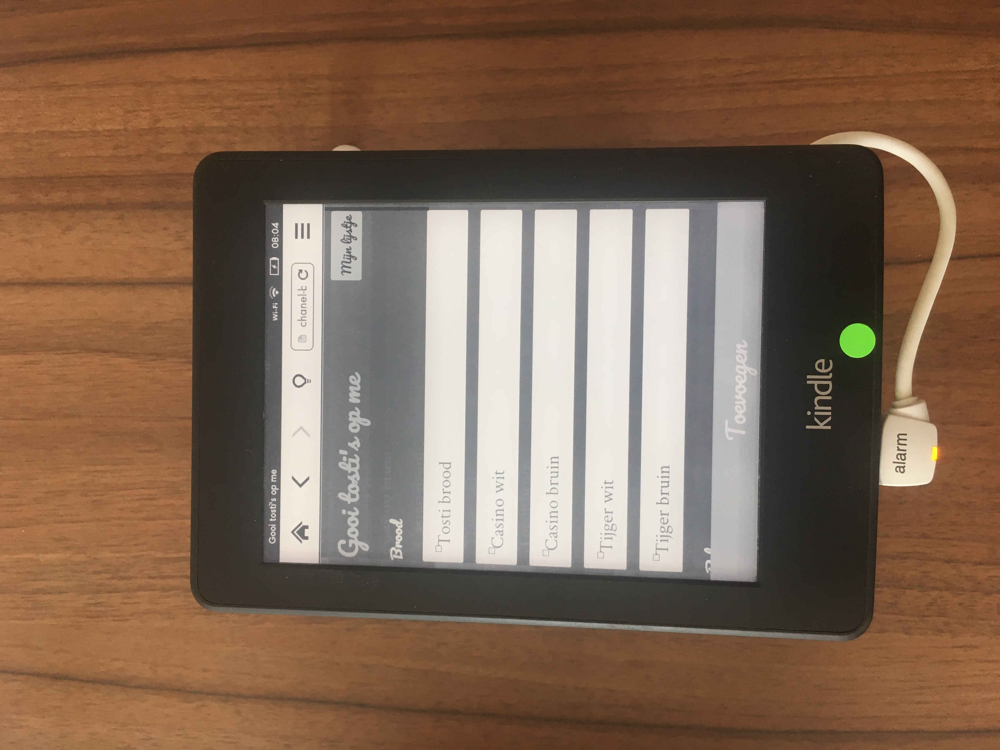

# Gooi tosti's op me


## Introduction
'Gooi tosti's op me' is an **online grocery list**, specifically for grilled cheese, the final assignment of Browser Technologies. You can create your own grilled cheese grocery list bij selecting the ingredients that you need and adding them. If you have a newer browser you can use drag and drop to add products.

The application is also backwards compatible until IE8 and responsive. When javascript is turned off the app will still work, even when css can not be loaded, the basic functionality of the app can be used.

*Previous assignments can be viewed in folder 'Week1' and 'Week2'*

## Demo
A demo is viewable on http://chanel-browser-technologies.herokuapp.com/

## Features
- Backwards compatibility.
- Progressive enhanced with drag and drop.
- Mobile first: responsive design.
- On mobile the grocerylist slides in when you click 'Mijn lijstje'.
- After adding items and reloading page, user gets feedback that items are added.

## Installation
### Get Started
**Node.js required**
- Install the packages in package.json.
- Setup an express server, javascript template and all the folders.
- Create a *script in 'routes'* and add the route to that file in your **servers sided script**.
- In your script in routes add a get that renders the homepage.
- Depending on your template create files that will generate html. Add a form for the ingredients and a section which will be used to display your list. Add all the ingredients you want and add checkboxes to them. At the end add a input submit button.

### Get the items
- To get the selected items and send them to the server, on the **server sided script** add a post:

```javascript
router.post('/', check.single(), function(req, res){
  var unflattendItems = req.body;
  //Flatten is used to flatten arrays
  var flattenItems = flatten(unflattendItems);

  res.render('content/index', {
    myList: flattenItems
  });
});
```
With `req.body` we get the selected items. Because this will return nestedData we flatten it by using the node module of the same name. After that we can render the page again with the selected data in our grocery list.

### Progressive enhancement
The code we used works on every browser because *it doesn't depend on client sided javascript and css*. The basic functionality is available for everyone. To enhance the experience we could add a drag and drop.

For drag and drop we are going to use client sided javascript.
- Add a script to folder *public or your own client sided folder*.
- To detect if browsers are able to support the code, add feature detection:

```javascript
if(document.addEventListener){
}
```
- Inside the if statement save the list elements and the grocery list in variables.
- Loop through the list items and add Event Listeners `'dragstart'` and `'dragend'` to them.
- To the grocery list add the Event Listeners `'dragenter'`, `'dragover'` and `'drop'`.
- Create variable with an object. Every property will contain a function that will handle a different part of drag and drop.

#### Property 1: starts
`starts` will handle the data transfer of the target element:
```javascript
function(e){
    dragEl = this;
    e.dataTransfer.effectAllowed = 'move';
    e.dataTransfer.setData('Text', this.innerHTML);
}
```
I also used it to add a class to give the dropzone a color and a dashed border.
#### Property 2: over
Making sure that redirects or reloads don't occur:
```javascript
function(e){
    if(e.preventDefault){
        e.preventDefault();
    }
    return false;
}
```
#### Property 3: enter
I used enter to add a extra class to the grocery list, kind of like a hover:
```javascript
function(e){
    this.classList.add('drophere');
}
```
#### Property 4: drop
In the drop event add the data to a new list item in our grocery list:
```javascript
function(e){
    if(e.stopPropagation){ //Terminate event
        e.stopPropagation();
    }

    if(dragEl != this){ //If the data isn't the same
        dragEl = this.innerHTML;
        this.innerHTML += '<li class="groceryitem">' + e.dataTransfer.getData('Text') + '</li>';//get data and place it into a list item.
    }
    return false;
}
```
#### Property 5: end
When everything has ended, remove the ability to drag and drop the same item again. Remove the classes that give the user visual feedback when they are dragging.
```javascript
function(e){
    e.target.draggable = false;
    dropSection.classList.remove('drophere');
    dropSection.classList.remove('dropzone');
}
```

## Test results
### Accessibility
#### Keyboard
The grocery list still works when a user only uses his keyboard. The elements get a purple outline on focus. Ingredients can be selected with the spacebar. User can navigate to the submit button using the tab button and use enter to add the groceries to their list.

#### Screenreader
Semantic HTML is used in this webappplication so that it would be accessible for screenreaders. Every section contains a header, no links were used instead of buttons or `input[type="submit"]`. The app is fully accessible when you are using a screenreader.

### Browser support
I tested on these devices/browsers:

Apple iPad | Apple iPod | OP(?)
--- | --- | ---
 |  | 
On the iPad the app worked fine. The sliding grocery list worked, you could select ingredients and the selected elements would have a different color. You could add them them to your list. | On the iPad the basic functionality worked but the sliding grocery list animation did not work. It just popped up when you clicked the button. The text was also too big, because of that the title was partially hidden behind the 'Mijn lijstje' button. | On this device (don't know the name), the css property `appearance: none;` didn't work, causing the buttons to look a bit different.

Nexus | Windows phone | Kindle
--- | --- | ---
 |  | 
Same as the iPad, Nexus had no problems with the app. | On a Windows Phone the app works fine but same as  the iPod, the text was way too big. | The Kindle screenreader had a experimental browser that wasn't really capable of a lot. `position: fixed,` had partial support and worked as `position: absolute;` so the button 'Toevoegen' did not stay at the bottom of the screen. Also the animation for the grocery list did not work. Toggling the grocery list did work so the basic functionality of adding and viewing your list worked. Selected items didn't change color but the checkboxes were visble for feedback.

IE8 | IE11 | Chrome | Safari iOS | Safari MacOS
--- | --- | --- | --- | ---
The basic functionality works on IE8 but the drag and drop did not work. Also `clip: rect(0, 0, 0, 0)` is not supported so the checkboxes were visible. Hover states and changing color when selected didn't work but focus states did. | Surprisingly after a lot of hours the drag and drop worked on IE11 and so did everything else | Chrome is the browser  for programmers. Ultimately the app worked the way it should work. | I forgot the `appearance: none;` when I tested on my iPhone so the buttons had default styling. Other than that it worked fine.| Everything worked perfectly on safari. On desktop the drag and drop worked.

## Bugs
- [ ] After drag and drop, focus styles don't work properly.
- [ ] IE8 doesn't support media queries so styling isn't optimal.
- [ ] Focus style only viewable once on older browsers.
- [ ] Give user feedback that they can't add the same item twice.
- [ ] Add reset button.

## References
- [Stackoverflow issue about addEventListener feature detection](http://stackoverflow.com/questions/39272718/how-do-i-detect-document-addeventlistener-support-in-javascript)
- [Side navigation](https://www.w3schools.com/howto/howto_js_sidenav.asp)
- [Drag and drop](https://www.html5rocks.com/en/tutorials/dnd/basics/)

## License
MIT/X11.
