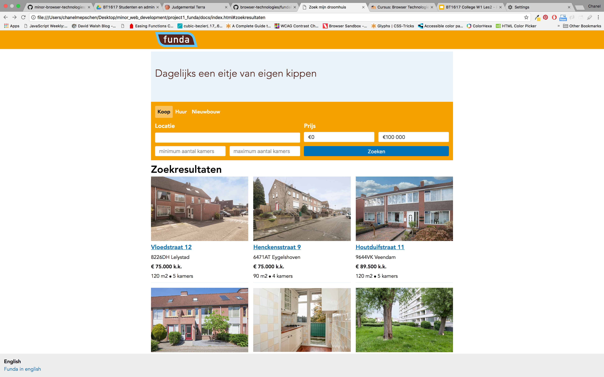
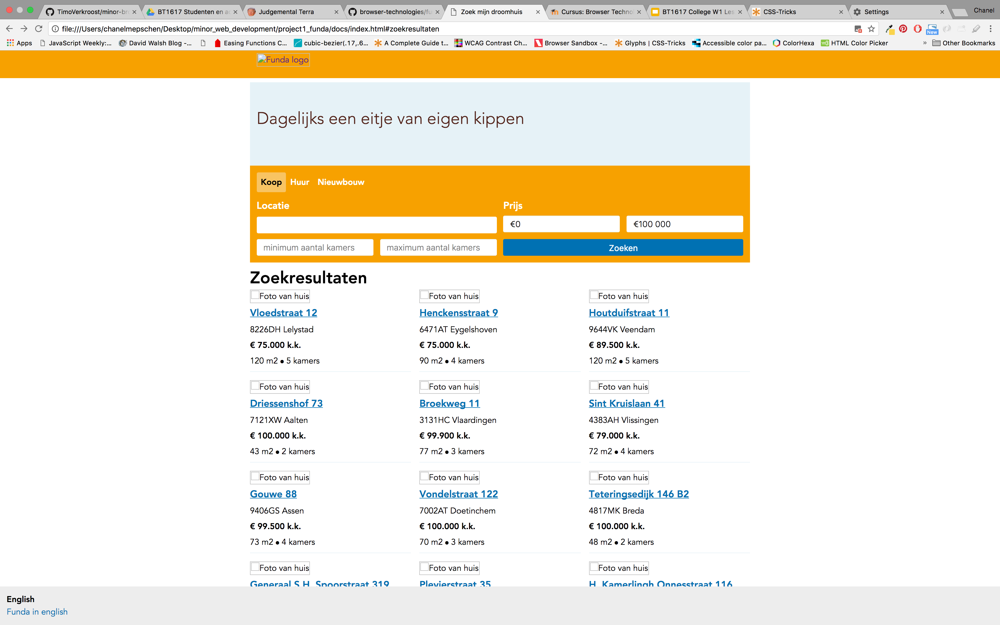
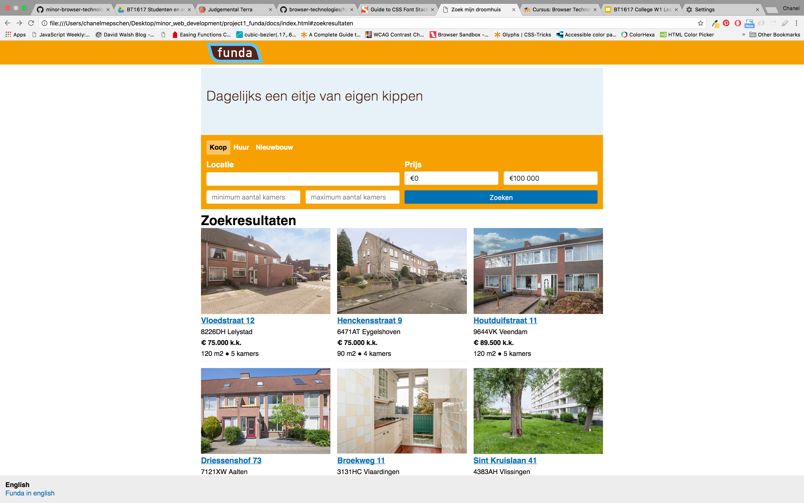
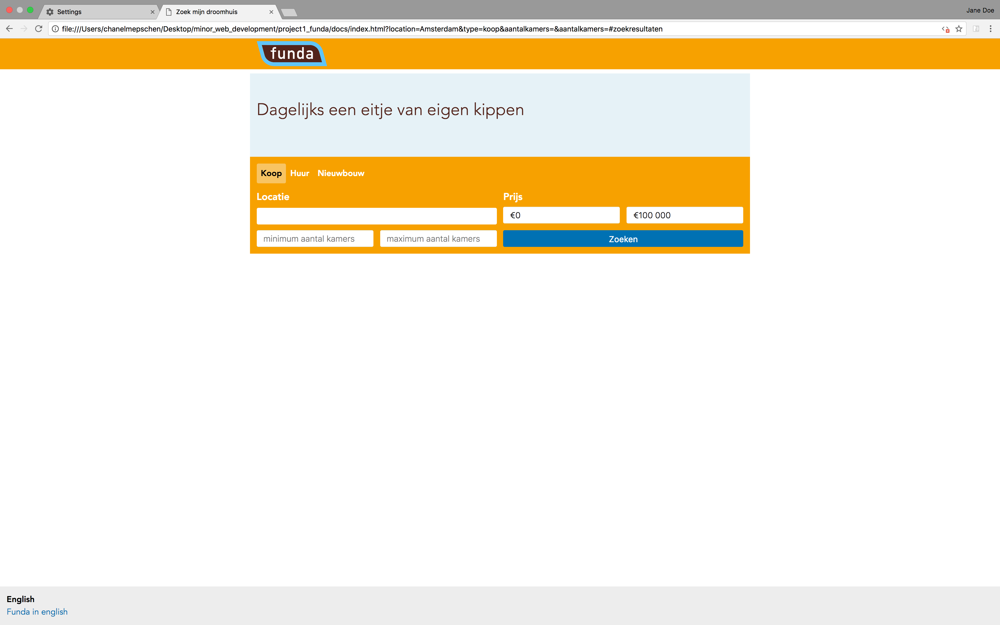
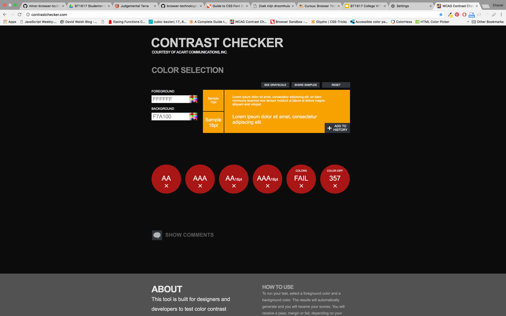
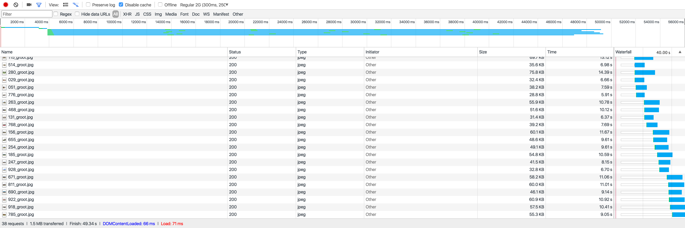
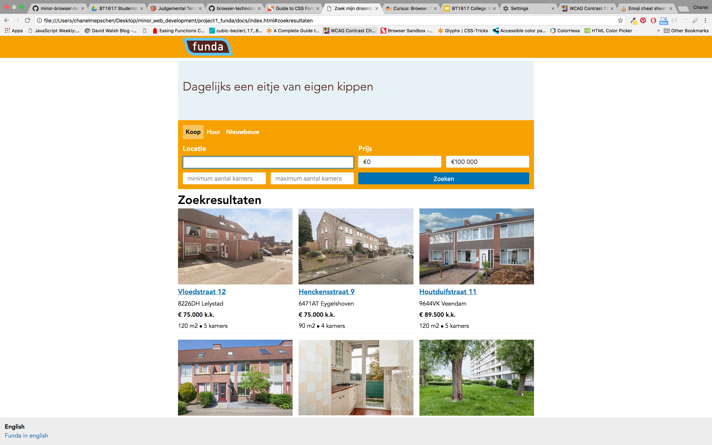

# Assignment 1.2: Funda Refactor
## Introduction
## The 8* commandments of Progressive Enhancement
**There are more, but these are the ones we focused on.**
### 1. You shall not depend on *pictures*
Pictures have (most of the time) the biggest filesizes and that's why loading them can take quite some time. And when we're browsing the web, we want to do it fast and we don't want to have the feeling that it's taking forever to load. So optimizing images is crucial. But some people have images turned off as default setting so that it saves them MB's.

It's our responsibility to create a website that is still usable when images, for some reason, are not displayed. And when they are visible, that they do not interfere too much with the loading time of the content.

##### Ways you can optimize:
- Add an ```alt=""``` to your `````` so when the picture doesn't load, people still know what was displayed on the picture.
- Paste the `````` into a ```<picture>``` and use different sizes for different screens.
- Compress the excisting images. Maybe the filesize will get smaller without losing quality.
- Use fileformat WEBP for your pictures, but do you use fallbacks for this one, since not every browser knows what to do with it.

### 2. You shall use fallbacks for *custom fonts*
There was a period of time where developers were jumping up and down for custom fonts. They made things like icon fonts and it was great for them until they found out that custom fonts can be blocked by browsers or even content blockers. It's okay to use them but I strongly recommend using a fallback for when things go south.

##### Ways you can optimize:
- If you're are using an icon font, just change into SVG's or even PNG's. No costum font needed. You can also place all the icons into one image and using sprite only show the right icons in the given size.
- Make use of font-stacking with font-family. When your first font doesn't load, there is always the second (or third or fourth). Great article about font-stacking [here](https://www.smashingmagazine.com/2009/09/complete-guide-to-css-font-stacks/).
- Testing, testing and more testing. Always test if different browsers and operating systems to check if the fonts you defined are working.

### 3. You're website shall work without *JavaScript*
When JavaScript was created, it added a lot more possibilities to the web. Everyone started using the new language, it made your website even better. Soon websites could only work if JavaScript was loaded, which provided some complications, because there were a lot of reasons why JavaScript regularly failed to load, such as HTTP Request failed, firewall bocks JS, ISP or mobile operator interfere with JS download, JS is turned off, CDN down and browser doesn't support written JS (1). Please, let your website work without JS.

##### Ways you can optimize:
- Make sure your website's content is still viewable, when JavaScript isn't loaded. You can do this by placing the ``<script>`` at the bottom of the page inside the body or in the head with a ```defer``` attribute.
- (Last resort) Give the user some feedback why your page isn't working. If you really don't know how to make your page work without JS then at least give them feedback.

### 4. You shall use the right contrast with *color*
As designers/developers we tent to forget not everybody has a high resolution screen and easily overlook that our chosen colors might not have the right contrast on every screen. But there are also color blind people in the world who can't distinguish a particular pair of colors.

##### Ways you can optimize:
- Use Contrast checkers and simulators. There are plugins, add-ons, websites and desktop apps you can use to experience how others view the world and if the contrast is good enough.
- User testing. Try to find color blind people so that they can test your website. You will get a lot of insight on how good the colors are.
- Platform testing. This is somethin you can do easily. Just use your old laptop for this or computers of old people and you will notice that te color on every platform is quite different.

### 5. You shall take into account that *broadband internet* is rare
I live in a first world country (The Netherlands) were the internet is pretty fast compared to the rest of the world. Internet in second or third world countries may not be that fast or maybe you already used all your data which results in slow internet. Developing gigantic webpages and creating extremely crazy stuff may not be a problem for our internet but for others the page may never load and you will lose customers.

##### Ways you can optimize:
- Use a performance budget
- Decide a maximum size for all the documents that need to load when viewing the page.
- Fully use your Devtools to get more insights on loadingspeed.

### 6. You shall not depend on *cookies*
A few years ago a new law required asking the user for permission to save user information in cookies. with that came the option for the user to automatically not allow cookies. And the result? Of course, some websites just broke.

##### Ways you can optimize:
- Server-based session storage(2). The performance will be better and it is more secure.

### 7. You shall not depend on *localStorage*
The difference between cookies and localStorage is that cookies are both client side and server side and localStorage is only client side (5). LocalStorage is great for when your website doesn't have a server-side, isn't pushing logins after interactivity or when it only lives on the client (3). But (there is always a but) localStorage doesn't work on all browsers and it doesn't work all the time. Plus it has limited capacity.

##### Ways you can optimize:
- When you do want to store something, use the server (2).

### 8. You're website shall work without usage of a *Mouse/Trackpad*
Believe it or not, not everyone uses (or owns) a mouse/trackpad. Some people don't like them and some people have a physical disability and can't use them. These people use the the keyboard to navigate the page.

##### Ways you can optimize:
- Make a logic order so that tabbing feels natural.
- If that messes up your page use tab-index.
- Make the focus state very obvious so the user knows where they are on the page.

## Funda testing

*How the funda website looks when everything works as intended*

What if we test our Funda page on these 8 features? What would happen if we 'turned' those features off? What needs to be done to fix the problems that occur? Let's take a look at those test results.

### No pictures


Without pictures turned on, the page still works and falls back to alt text. Luckily, the search results stay structured. I could add a backup background-color to the position of the picture which would be visible when images don't load.

### No custom fonts


I already had fallbacks for when custom fonts aren't supported so the styling rarely changes, because the fallback font looks like the font Funda is using.

```css
body {
    font-family: 'Avenir', 'Al Tarikh', sans-serif;
}
```

### No JavaScript


The Funda app I created depends on javascript. API calls are made with Aja, a JS library on the client-side so when javascript cannot be executed the whole app crashes. Rendering is done with transparency so even when API calls magically work, rendering the response would still fail.

### Contrast Checker


The white on orange that Funda uses in their design doesn't work really good according to the contrast checker. The color combination doesn't pass on:
- Fonts below 18 points (old and new success criterion).
- Fonts over 18 points (old and new success criterion).
- Brightness and color difference.
- Readability for colorblind people.

I could turn the white color into black, the result of the contrast checker is green for every criterion.

### Slow Internet


The DOM renders pretty fast but loading all the pictures takes a long time, when you're on regular 2G. After 10 seconds the first image is loaded in the DOM.

### No Cookies
I didn't use cookies while creating this Funda app :tada::tada:!

### No localStorage
I didn't use localStorage while creating this Funda app :tada::tada:!

### No Mouse/trackpad


Navigating through the page with a keyboard is possible but the focus styles aren't always visible. Such as the focus style on search button. The button changes from blue to orange on focus and on desktop it's not clear anymore which element has focus.

Creating a more visible focus style should resolve this problem.

### Screenreader
Because the labels in the desktop version of Funda aren't displayed, the screenreader doesn't read the labels, leaving the user guessing what kind of information is required of them.


## Sources
1. Kryogenix.org. (no date). *Everybody has JavaScript, right?*. Source: https://kryogenix.org/code/browser/everyonehasjs.html
2. Grove, R. (August 12, 2008). *Why you probably shouldn't use cookies to store session data*. Source: http://wonko.com/post/why-you-probably-shouldnt-use-cookies-to-store-session-data
3. Fox, P.. (no date). *Local Storage Use Not Abuse*. Source: http://localstorage-use-not-abuse.appspot.com/
4. Morony, J. (January 31, 2017). *A Summary of Local Storage Options for PhoneGap Applications*. Source: https://www.joshmorony.com/a-summary-of-local-storage-options-for-phonegap-applications/
5. Chaudhary, A. (January 5, 2016). *Difference between Local Storage, Session Storage and Cookies*. Source: http://www.c-sharpcorner.com/uploadfile/cd7c2e/difference-between-local-storage-session-storage-ans-cookie/
